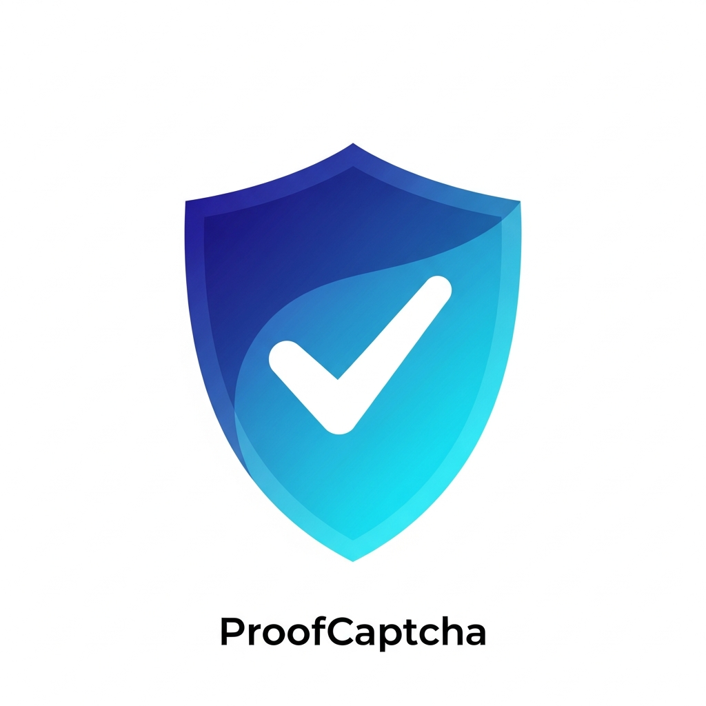

# ProofCaptcha

<div align="center">
  
  
  **Advanced Proof-of-Work CAPTCHA System**
  
  Modern, secure, and developer-friendly bot protection with end-to-end encryption
  
  [](LICENSE)
  [](SECURITY.md)
</div>

---

## 📖 Table of Contents

- [Overview](#overview)
- [Key Features](#key-features)
- [How It Works](#how-it-works)
- [Security Architecture](#security-architecture)
- [Quick Start](#quick-start)
- [Integration Guide](#integration-guide)
- [API Reference](#api-reference)
- [Challenge Types](#challenge-types)
- [Advanced Configuration](#advanced-configuration)
- [Best Practices](#best-practices)
- [Contributing](#contributing)

---

## 🎯 Overview

**ProofCaptcha** adalah sistem CAPTCHA berbasis proof-of-work yang dirancang untuk melindungi website dari bot otomatis menggunakan tantangan kriptografis. Berbeda dengan CAPTCHA tradisional berbasis gambar, ProofCaptcha menggunakan tantangan komputasi yang mudah untuk manusia tetapi mahal untuk bot dalam skala besar.

### Mengapa ProofCaptcha?

- ✅ **Lebih Aman**: End-to-end encryption dengan ECDH + AES-GCM
- ✅ **Lebih Modern**: Tidak ada lagi "klik semua traffic light"
- ✅ **Developer-Friendly**: API sederhana, dokumentasi lengkap
- ✅ **Privacy First**: Tidak melacak pengguna, tidak menjual data
- ✅ **Self-Hosted**: Kontrol penuh atas data Anda

---

## 🚀 Key Features

### Security Features
- 🔐 **End-to-End Encryption**: Data challenge dan solution terenkripsi dengan AES-GCM
- 🛡️ **Server-Side Encryption Control**: Server menentukan mode enkripsi, mencegah downgrade attack
- 🔑 **Session-Based Key Management**: Setiap sesi memiliki kunci enkripsi unik
- 🎯 **Domain Validation**: API key terikat ke domain spesifik
- ⏱️ **Token Expiration**: Challenge dan verification token memiliki waktu kadaluarsa
- 🚫 **Replay Attack Prevention**: Setiap token hanya bisa digunakan sekali
- 📊 **Risk Scoring**: Analisis otomatis tingkat risiko setiap request
- 🤖 **Bot Detection**: Multi-layer detection (fingerprint, behavior, automation tools)

### Developer Experience
- 📦 **Easy Integration**: Hanya perlu 3 baris kode
- 🔄 **reCAPTCHA v2 Compatible**: Drop-in replacement untuk reCAPTCHA
- 🎨 **Multiple Challenge Types**: Grid, Jigsaw, Slider, Checkbox, Gesture, Upside-Down
- 📱 **Responsive Design**: Bekerja di desktop dan mobile
- 🌐 **Multi-Language Support**: Mudah diterjemahkan
- 📈 **Analytics Dashboard**: Monitor traffic dan success rate

---

## 🔄 How It Works

ProofCaptcha menggunakan arsitektur three-step verification yang aman:

### Step 1: Challenge Generation

```
Client                          Server
  |                               |
  |---(1) Request Challenge------>|
  |    POST /api/captcha/challenge|
  |    { publicKey, type }        |
  |                               |
  |                               |---(2) Create Session
  |                               |    Generate ECDH keypair
  |                               |    Derive shared secret (HKDF)
  |                               |
  |<--(3) Encrypted Challenge-----|
  |    { token, encrypted: {      |
  |      ciphertext,              |
  |      iv, authTag } }          |
  |                               |
  |---(4) Decrypt Challenge-------|
  |    Using session key          |
```

**Detail Proses:**
1. **Client** mengirim request dengan public key (API key) dan tipe challenge yang diinginkan
2. **Server** melakukan:
   - Validasi domain dan API key
   - Risk assessment (IP, fingerprint, behavioral analysis)
   - Generate ECDH keypair untuk session
   - Derive shared secret menggunakan HKDF (ECDH + SHA-256)
   - Buat challenge data (proof-of-work parameters, puzzle data, dll)
   - **Encrypt challenge** dengan AES-GCM menggunakan session key
3. **Server** mengembalikan encrypted challenge dengan token
4. **Client** decrypt challenge menggunakan session key yang sama (derived dari ECDH)

### Step 2: Solution Verification

```
Client                          Server
  |                               |
  |---(5) Solve Challenge-------->|
  |    (Proof-of-work,            |
  |     puzzle solution, etc)     |
  |                               |
  |---(6) Encrypt Solution------->|
  |    Using session key          |
  |                               |
  |---(7) Submit Solution-------->|
  |    POST /api/captcha/verify   |
  |    { token, encrypted: {      |
  |      ciphertext, iv,          |
  |      authTag } }              |
  |                               |
  |                               |---(8) Decrypt Solution
  |                               |    Verify HMAC signature
  |                               |    Validate solution
  |                               |    Check expiration
  |                               |
  |<--(9) Verification Token------|
  |    { success: true,           |
  |      verificationToken }      |
```

**Detail Proses:**
5. **Client** menyelesaikan challenge (compute proof-of-work, solve puzzle, dll)
6. **Client** encrypt solution dengan AES-GCM menggunakan session key
7. **Client** kirim encrypted solution dengan token
8. **Server** melakukan:
   - Retrieve session key dari cache
   - **Decrypt solution** dengan AES-GCM
   - Verify HMAC signature untuk authenticity
   - Validate solution sesuai tipe challenge
   - Check token expiration dan replay attack
9. **Server** generate verification token (JWT) jika valid

### Step 3: Backend Token Validation

```
Client                    Your Backend              ProofCaptcha Server
  |                            |                            |
  |---(10) Submit Form-------->|                            |
  |     + verificationToken    |                            |
  |                            |                            |
  |                            |---(11) Validate Token----->|
  |                            |    POST /api/captcha/      |
  |                            |    verify-token            |
  |                            |    Authorization: Bearer   |
  |                            |    { token }               |
  |                            |                            |
  |                            |                            |---(12) Verify JWT
  |                            |                            |    Check signature
  |                            |                            |    Validate expiration
  |                            |                            |    Check replay
  |                            |                            |    Domain matching
  |                            |                            |
  |                            |<---(13) Success/Fail-------|
  |                            |    { success: true/false } |
  |                            |                            |
  |<---(14) Response-----------|
  |     (form processed)       |
```

**Detail Proses:**
10. **Client** submit form dengan verification token ke backend Anda
11. **Your Backend** validate token ke ProofCaptcha server dengan secret key
12. **ProofCaptcha Server** melakukan:
    - Verify JWT signature dengan secret key
    - Check token expiration (max 5 menit)
    - Validate domain matching
    - Check replay attack prevention
13. **ProofCaptcha Server** return success/fail
14. **Your Backend** process form jika token valid

---

## 🔒 Security Architecture

### Encryption Flow

ProofCaptcha menggunakan **hybrid encryption** untuk keamanan maksimal:

#### 1. Key Derivation (ECDH + HKDF)

```
Client Key Pair         Server Key Pair
  privateKey (ephemeral)  privateKey (session-based)
  publicKey               publicKey

         |                      |
         |                      |
         +-----> ECDH <---------+
                  |
                  v
           Shared Secret (256-bit)
                  |
                  v
        HKDF (SHA-256, salt, info)
                  |
            +-----+-----+
            |           |
      AES Key     HMAC Key
      (256-bit)   (256-bit)
```

**Key Points:**
- **ECDH (P-256)**: Generate shared secret tanpa transmisi private key
- **HKDF**: Derive AES key dan HMAC key dari shared secret
- **Salt**: challengeId hash (SHA-256) untuk uniqueness
- **Info**: `ProofCaptcha-v1-encrypt|decrypt-{hashedChallengeId}` untuk context binding

#### 2. Data Encryption (AES-GCM)

```
Plaintext Data
      |
      v
  AES-GCM Encryption
  - Key: Derived AES key (256-bit)
  - IV: Random (96-bit)
  - Additional Data: challengeId (for binding)
      |
      v
  Ciphertext + Authentication Tag
```

**Security Properties:**
- **Confidentiality**: AES-256-GCM encryption
- **Integrity**: GMAC authentication tag
- **Authenticity**: HMAC signature verification
- **Freshness**: Timestamp dan nonce dalam token

#### 3. Server-Side Security Control

**CRITICAL SECURITY FEATURE**: Server **SELALU** menentukan mode enkripsi

```javascript
// ❌ DANGER - Client menentukan enkripsi (OLD CODE)
POST /api/captcha/challenge
{
  "publicKey": "pk_xxx",
  "supportsEncryption": true  // ⚠️ CLIENT CONTROLLED
}

// ✅ SECURE - Server menentukan enkripsi (NEW CODE)
POST /api/captcha/challenge
{
  "publicKey": "pk_xxx"
  // supportsEncryption DIHAPUS dari client
}

// Server logic:
if (sessionExists) {
  // WAJIB gunakan enkripsi
  useEncryption = true;
} else {
  // Fallback ke plaintext
  useEncryption = false;
}
```

**Mengapa Ini Penting?**
- ❌ Jika client menentukan: Bot bisa force `supportsEncryption: false` → plaintext
- ✅ Jika server menentukan: Tidak ada downgrade attack, enkripsi enforced
- 🔒 Session-based: Setiap user dengan session aktif **WAJIB** menggunakan enkripsi

### Multi-Layer Bot Detection

ProofCaptcha menggunakan 5 layer deteksi:

1. **IP Reputation**: Track failed attempts, temporary blocking
2. **Device Fingerprinting**: Canvas, WebGL, Audio, Font fingerprints
3. **Behavioral Analysis**: Mouse movement, timing patterns
4. **Automation Detection**: WebDriver, headless browser detection
5. **Risk Scoring**: Kombinasi semua faktor untuk risk level

---

## 📦 Quick Start

### 1. Installation

```html
<!-- Load the ProofCaptcha API -->
<script src="https://your-domain.com/proofCaptcha/api.js" async defer></script>
```

### 2. Frontend Integration

```html
<!DOCTYPE html>
<html>
<head>
  <title>ProofCaptcha Demo</title>
</head>
<body>
  <form id="myForm">
    <input type="text" name="username" placeholder="Username" required>
    <input type="email" name="email" placeholder="Email" required>
    
    <!-- ProofCaptcha Widget -->
    <div class="proofCaptcha" 
         data-sitekey="YOUR_PUBLIC_KEY"
         data-callback="onCaptchaSuccess">
    </div>
    
    <button type="submit">Submit</button>
  </form>

  <script>
    function onCaptchaSuccess(token) {
      console.log('CAPTCHA verified! Token:', token);
      // Token akan otomatis di-submit dengan form
    }
  </script>
  <script src="https://your-domain.com/proofCaptcha/api.js" async defer></script>
</body>
</html>
```

### 3. Backend Verification (Required!)

**⚠️ CRITICAL**: Anda **WAJIB** memvalidasi token di backend!

#### Node.js/Express Example

```javascript
const express = require('express');
const fetch = require('node-fetch');

const app = express();

app.post('/submit-form', async (req, res) => {
  const { username, email, 'g-recaptcha-response': captchaToken } = req.body;

  // STEP 1: Validate CAPTCHA token
  const verifyResponse = await fetch(
    'https://your-domain.com/api/captcha/verify-token',
    {
      method: 'POST',
      headers: {
        'Content-Type': 'application/json',
        'Authorization': `Bearer ${process.env.CAPTCHA_SECRET_KEY}`,
      },
      body: JSON.stringify({ token: captchaToken })
    }
  );

  const verifyResult = await verifyResponse.json();

  if (!verifyResult.success) {
    return res.status(400).json({ 
      error: 'CAPTCHA verification failed' 
    });
  }

  // STEP 2: Process your form
  // Save to database, send email, etc.
  
  res.json({ success: true });
});
```

#### PHP Example

```php
<?php
function validateCaptcha($token) {
    $url = 'https://your-domain.com/api/captcha/verify-token';
    
    $ch = curl_init($url);
    curl_setopt($ch, CURLOPT_RETURNTRANSFER, true);
    curl_setopt($ch, CURLOPT_POST, true);
    curl_setopt($ch, CURLOPT_POSTFIELDS, json_encode(['token' => $token]));
    curl_setopt($ch, CURLOPT_HTTPHEADER, [
        'Content-Type: application/json',
        'Authorization: Bearer ' . getenv('CAPTCHA_SECRET_KEY')
    ]);
    
    $response = curl_exec($ch);
    curl_close($ch);
    
    return json_decode($response, true);
}

// Handle form submission
if ($_SERVER['REQUEST_METHOD'] === 'POST') {
    $captchaToken = $_POST['g-recaptcha-response'];
    
    $result = validateCaptcha($captchaToken);
    
    if (!$result['success']) {
        die('CAPTCHA verification failed');
    }
    
    // Process form...
}
?>
```

#### Python/Flask Example

```python
import requests
from flask import Flask, request, jsonify

app = Flask(__name__)

@app.route('/submit-form', methods=['POST'])
def submit_form():
    captcha_token = request.json.get('g-recaptcha-response')
    
    # Validate CAPTCHA
    verify_response = requests.post(
        'https://your-domain.com/api/captcha/verify-token',
        headers={
            'Content-Type': 'application/json',
            'Authorization': f'Bearer {os.getenv("CAPTCHA_SECRET_KEY")}'
        },
        json={'token': captcha_token}
    )
    
    result = verify_response.json()
    
    if not result.get('success'):
        return jsonify({'error': 'CAPTCHA verification failed'}), 400
    
    # Process form...
    return jsonify({'success': True})
```

---

## 🎮 Challenge Types

### 1. Checkbox (Proof-of-Work)

Tipe paling sederhana - user klik checkbox, browser compute SHA-256 hash.

```html
<div class="proofCaptcha" 
     data-sitekey="YOUR_KEY"
     data-type="checkbox">
</div>
```

**Karakteristik:**
- Paling cepat untuk user
- Proof-of-work di background
- Risk-adaptive difficulty

### 2. Grid Selection

User memilih gambar yang sesuai kriteria (e.g., "pilih semua traffic light").

```html
<div class="proofCaptcha" 
     data-sitekey="YOUR_KEY"
     data-type="grid">
</div>
```

**Karakteristik:**
- Familiar untuk user
- 3x3 grid dengan 9 opsi
- Dynamic category selection

### 3. Jigsaw Puzzle

User drag puzzle piece ke posisi yang benar.

```html
<div class="proofCaptcha" 
     data-sitekey="YOUR_KEY"
     data-type="jigsaw">
</div>
```

**Karakteristik:**
- Interactive dan engaging
- Behavioral analysis dari drag pattern
- Pixel-perfect validation

### 4. Slider

User geser slider sampai gambar align.

```html
<div class="proofCaptcha" 
     data-sitekey="YOUR_KEY"
     data-type="slider">
</div>
```

**Karakteristik:**
- Mobile-friendly
- Smooth animation
- Position tolerance validation

### 5. Gesture Pattern

User gambar pattern pada grid 3x3.

```html
<div class="proofCaptcha" 
     data-sitekey="YOUR_KEY"
     data-type="gesture">
</div>
```

**Karakteristik:**
- Unik dan sulit di-bot
- Touch dan mouse support
- Pattern complexity validation

### 6. Upside-Down Animals

User identifikasi hewan yang posisinya terbalik.

```html
<div class="proofCaptcha" 
     data-sitekey="YOUR_KEY"
     data-type="upside_down">
</div>
```

**Karakteristik:**
- Fun dan engaging
- Cognitive challenge
- Multiple animal types

---

## 🔧 API Reference

### Client-Side API

#### Auto-Render Mode

```html
<div class="proofCaptcha" 
     data-sitekey="YOUR_PUBLIC_KEY"
     data-type="random"
     data-callback="onSuccess"
     data-expired-callback="onExpired"
     data-error-callback="onError">
</div>
```

**Attributes:**
- `data-sitekey` (required): Your public API key
- `data-type`: Challenge type (`random`, `checkbox`, `grid`, `jigsaw`, `slider`, `gesture`, `upside_down`)
- `data-callback`: Success callback function name
- `data-expired-callback`: Expiration callback
- `data-error-callback`: Error callback

#### Manual API

```javascript
// Render widget
const widgetId = proofCaptcha.render('container-id', {
  sitekey: 'YOUR_PUBLIC_KEY',
  type: 'grid',
  callback: (token) => {
    console.log('Success!', token);
  },
  'expired-callback': () => {
    console.log('Token expired');
  },
  'error-callback': (error) => {
    console.error('Error:', error);
  }
});

// Get response token
const token = proofCaptcha.getResponse(widgetId);

// Reset widget
proofCaptcha.reset(widgetId);

// Execute challenge
proofCaptcha.execute(widgetId);
```

### Server-Side API

#### POST /api/captcha/verify-token

Validate verification token dari client.

**Request:**
```bash
curl -X POST https://your-domain.com/api/captcha/verify-token \
  -H "Content-Type: application/json" \
  -H "Authorization: Bearer YOUR_SECRET_KEY" \
  -d '{"token": "verification_token_here"}'
```

**Response (Success):**
```json
{
  "success": true,
  "data": {
    "challengeId": "challenge_abc123",
    "domain": "example.com",
    "timestamp": 1699776000000
  }
}
```

**Response (Failure):**
```json
{
  "success": false,
  "error": "Invalid Token",
  "message": "Token verification failed or expired"
}
```

#### POST /proofCaptcha/api/siteverify

reCAPTCHA v2 compatible endpoint.

**Request:**
```bash
curl -X POST https://your-domain.com/proofCaptcha/api/siteverify \
  -d "secret=YOUR_SECRET_KEY" \
  -d "response=verification_token_here"
```

**Response:**
```json
{
  "success": true,
  "challenge_ts": "2025-11-11T12:00:00Z",
  "hostname": "example.com"
}
```

---

## 🛡️ Best Practices

### 1. Always Validate on Backend

```javascript
// ❌ DON'T - Frontend only validation
if (captchaToken) {
  submitForm(); // Bisa di-bypass!
}

// ✅ DO - Backend validation
app.post('/submit', async (req, res) => {
  const isValid = await validateCaptchaToken(req.body.token);
  if (!isValid) {
    return res.status(400).json({ error: 'Invalid CAPTCHA' });
  }
  // Process form...
});
```

### 2. Use Environment Variables for Secrets

```javascript
// ❌ DON'T - Hardcoded secrets
const SECRET_KEY = 'sk_abc123...';

// ✅ DO - Environment variables
const SECRET_KEY = process.env.CAPTCHA_SECRET_KEY;
```

### 3. Handle Errors Gracefully

```javascript
try {
  const result = await validateCaptchaToken(token);
  if (!result.success) {
    // Show user-friendly error
    return res.status(400).json({ 
      error: 'Please complete the CAPTCHA' 
    });
  }
} catch (error) {
  // Log error for debugging
  console.error('CAPTCHA validation error:', error);
  // Don't expose internal errors to user
  return res.status(500).json({ 
    error: 'Service temporarily unavailable' 
  });
}
```

### 4. Set Appropriate Timeouts

```javascript
const verifyResponse = await fetch(url, {
  method: 'POST',
  headers: headers,
  body: JSON.stringify({ token }),
  signal: AbortSignal.timeout(5000) // 5 second timeout
});
```

### 5. Domain Whitelisting

Always configure allowed domains in your API key settings:

```
✅ Specific domain: example.com
✅ Subdomain: *.example.com
❌ Wildcard: * (hanya untuk development)
```

---

## 🔍 Troubleshooting

### Error: "Invalid or inactive API key"

**Cause**: Public key tidak valid atau tidak aktif.

**Solution**:
1. Check API key di dashboard
2. Pastikan key status = "Active"
3. Regenerate key jika perlu

### Error: "Domain validation failed"

**Cause**: Request dari domain yang tidak diizinkan.

**Solution**:
1. Check allowed domain di API key settings
2. Pastikan `Origin` header match dengan allowed domain
3. Update domain whitelist jika perlu

### Error: "Token verification failed or expired"

**Cause**: Token sudah kadaluarsa atau invalid.

**Solution**:
1. Token maksimal 5 menit validity
2. Pastikan user submit form segera setelah complete CAPTCHA
3. Implement auto-refresh jika perlu

### Challenge Tidak Muncul

**Cause**: JavaScript error atau network issue.

**Solution**:
1. Open browser console, check for errors
2. Verify API script loaded correctly
3. Check network tab for failed requests
4. Ensure `data-sitekey` valid

---

## 📊 Analytics & Monitoring

ProofCaptcha menyediakan dashboard analytics untuk monitoring:

- **Success Rate**: Persentase challenge yang berhasil
- **Challenge Type Distribution**: Breakdown per tipe
- **Geographic Distribution**: Traffic per negara
- **Bot Detection Stats**: Blocked requests
- **Performance Metrics**: Response time

Access di: `https://your-domain.com/dashboard/analytics`

---

## 🤝 Contributing

Kami welcome contributions! Please read our [Contributing Guidelines](CONTRIBUTING.md).

### Development Setup

```bash
# Clone repository
git clone https://github.com/your-org/proofcaptcha.git

# Install dependencies
npm install

# Setup environment
cp .env.example .env
# Edit .env dengan config Anda

# Run migrations
npm run migrate

# Start development server
npm run dev
```

---

## 📄 License

MIT License - see [LICENSE](LICENSE) file for details.

---

## 🔗 Links

- 📚 **Documentation**: [Full API Docs](https://your-domain.com/docs)
- 🔒 **Security**: [Security Policy](SECURITY.md)
- 💬 **Support**: [GitHub Issues](https://github.com/your-org/proofcaptcha/issues)
- 🌐 **Website**: [https://your-domain.com](https://your-domain.com)

---

## 🙏 Acknowledgments

Built with:
- [Express.js](https://expressjs.com/)
- [React](https://react.dev/)
- [Web Crypto API](https://developer.mozilla.org/en-US/docs/Web/API/Web_Crypto_API)
- [PostgreSQL](https://www.postgresql.org/)

---

<div align="center">
  Made with ❤️ by the ProofCaptcha Team
  
  **Star ⭐ this repo if you find it helpful!**
</div>
